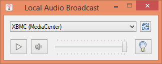

This is a fork of [protyposis Local Audio Broadcast](https://github.com/protyposis/LocalAudioBroadcast).
I needed a workaround for my AirLino-1445. By examining why the software didn't work with it, I also made some minor bugfixes and extensions to the prog. Maybe I'll continue with adding stuff here, maybe not :D - will see...
Cheers

Local Audio Broadcast
=====================

This simple application captures the local audio playback
in Windows and sends it over the local network to a UPnP renderer. 
I originally wrote it to stream Spotify music playback from 
my computer over the home network to my HTPC running XBMC/Kodi 
(since I wasn't satisfied with the available Spotify plugins), 
it can be used for any audio though.

The app has a simple GUI that offers the possibility to select a
target UPnP renderer and send the audio captured from the default
playback interface to it. It also acts as a UPnP server that can
be browsed from a UPnP controller, where audio streams of all
active playback devices (not just the default device) are served.

Download a binary release [here](https://github.com/protyposis/LocalAudioBroadcast/releases).

Features
--------

* Captures local audio playback from any playback device
* Supports multiple simultaneous streams to multiple renderers
* UPnP control point (to push the default playback stream to a UPnP renderer)
* UPnP server (to request a playback stream from a UPnP controller)
* Metadata embedding if requested by the renderer (supported e.g. by XBMC/Kodi and foobar2000)
    * Embeds the Spotify track name into the stream if a running instance is detected
    * Can be extended for other music players through a simple interface

Requirements
------------

* Windows 7+
* tested with XBMC 12, XBMC 13, Kodi 14 and foobar2000 1.3, Windows Media Player (WMP cannot browse server directory and only renders WAV)

Issues
------

* Depending on the buffering in the renderer, there can be a noticeable lag.
* The consumption of RAM grows slowly but constantly over hours of use until at some point it also starts hogging one CPU core and slowing down the system. This seems to be a bug in the UPnP library and also happens with other tools using the library.

License
-------

Copyright 2014 Mario Guggenberger <mg@protyposis.net>

Licensed under the Apache License, Version 2.0 (the "License");
you may not use this file except in compliance with the License.
You may obtain a copy of the License at

    http://www.apache.org/licenses/LICENSE-2.0

Unless required by applicable law or agreed to in writing, software
distributed under the License is distributed on an "AS IS" BASIS,
WITHOUT WARRANTIES OR CONDITIONS OF ANY KIND, either express or implied.
See the License for the specific language governing permissions and
limitations under the License.
